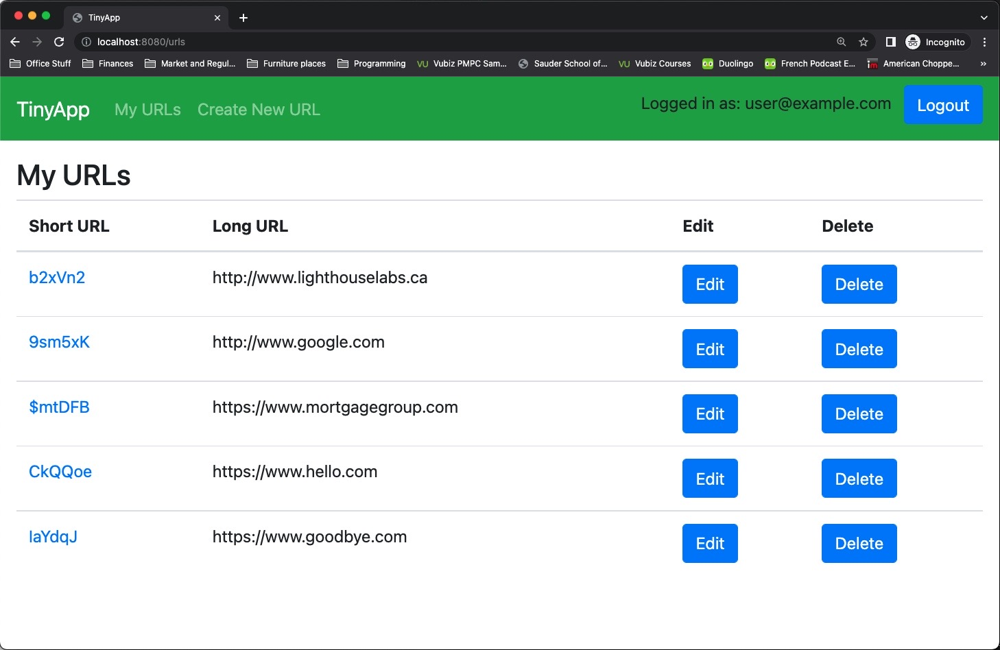

# Welcome to Tinyapp!

Tinyapp runs on port 8080.

If you navigate to localhost:8080, it should redirect you to the login page. 

1 user account exist for testing purposes and some sample url records are attached to each. 
user@example.com, password: hello

New users must register first by entering an email address and creating a password. Registering as a new user will also automatically log you in. Your logged in status is displayed in the app header.

Registration should fail if a user account already exists. Similarly, login will fail if the password provided doesn't match the user email (or if the email is not yet registered).

Once logged in, users can add new urls, modify existing longform urls, and delete urls from the library if no longer needed. 

Security is managed with hashed passwords (no plain text passwords are stored) and cookies are also encrypted. 

Enjoy!

tinyapp dependencies:
- bcrypt
- body-parser
- cookie-session
- ejs
- express
- method-override
